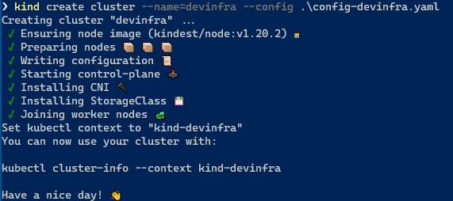

# KinD

## KinD installation

Following the [quick-start](https://kind.sigs.k8s.io/docs/user/quick-start/), installing `kind` in fairly straightforward.

```Powershell
choco install kind
```

### Creating a 3-node k8s-cluster

An example of running a multi-node cluster on docker can be done with `kind`. There are some restrictions with Windows. The provided config `./src/clusters/kind/config-devinfra.yaml` provides a 3-node cluster. There is also a `traefik` ingress test setup to verify your networking configuration.

To fire up the cluster, run the following:

```powershell
cd ./src/clusters/kind/
kind create cluster --name=devinfra --config .\config-devinfra.yaml
```

We specifically expose ports 80, 443 and 8100 to this cluster on ip `127.0.0.1`. Think carefully what ports to expose. `kind` has no update strategy to change this afterwards.



The cluster creation automatically add configuration to connect to the new cluster

```powershell
kubectl cluster-info --context kind-devinfra
```
